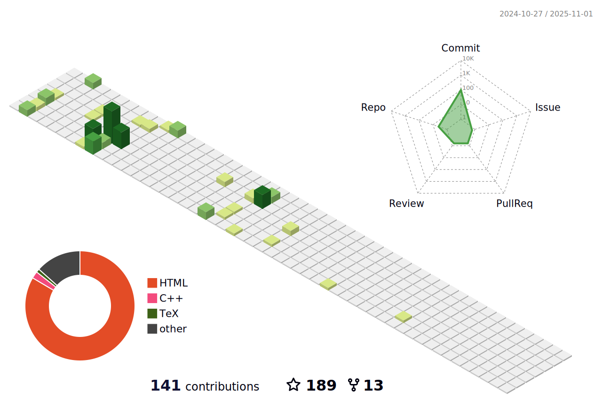
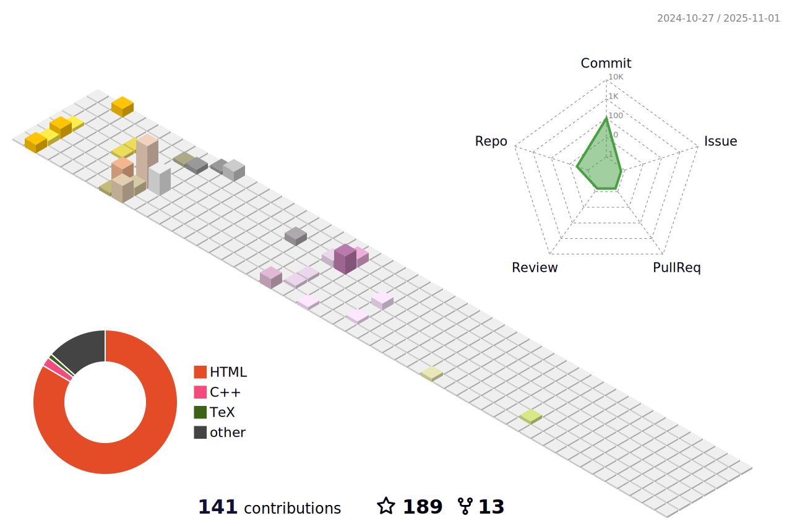
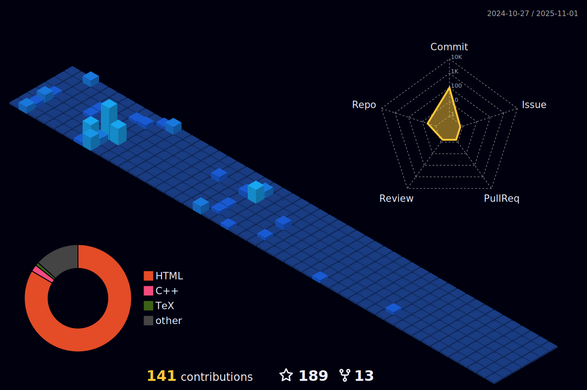

    

<h1 align="center">
    Hi , I'm Shatong Zhu
</h1>

    

- 🔭 I’m currently working on ...
- 🌱 I’m currently learning ...
- 👯 I’m looking to collaborate on ...
- 🤔 I’m looking for help with ...
- 💬 Ask me about ...
- 📫 How to reach me: ...
- 😄 Pronouns: ...

    

    

    

    

<!--

-->

<!--

    

-->
<h3 align="center" style='margin: 32px 4px 8px; font-size: 24px;'>
    Connect with me:
</h3>

    
    

